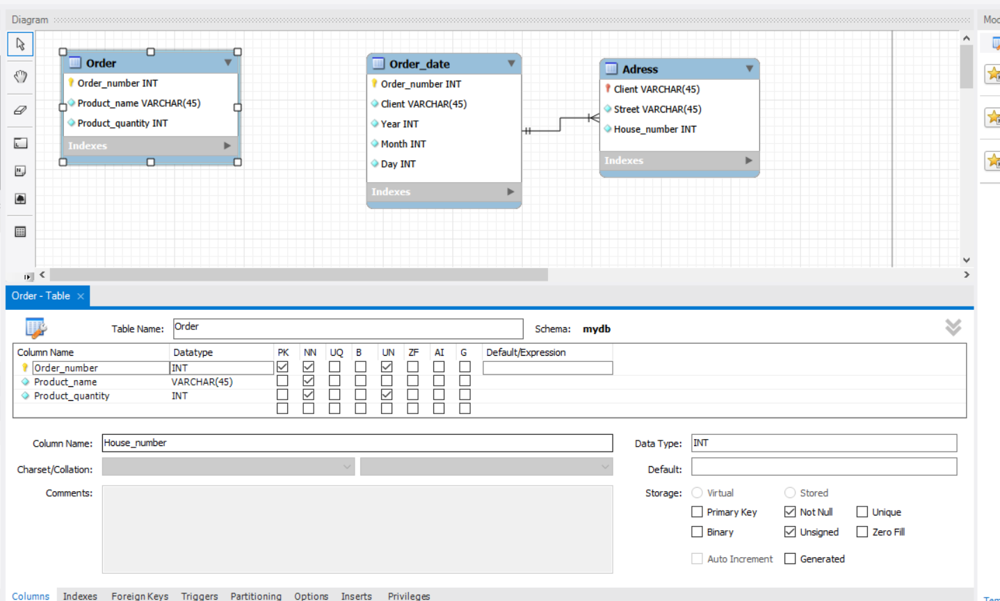
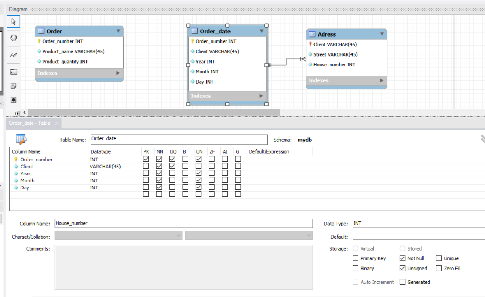
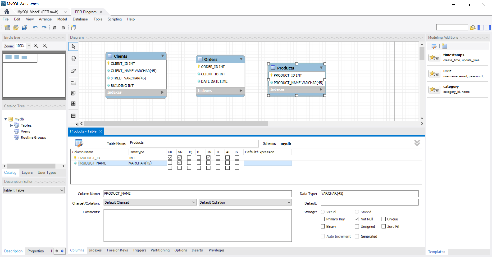
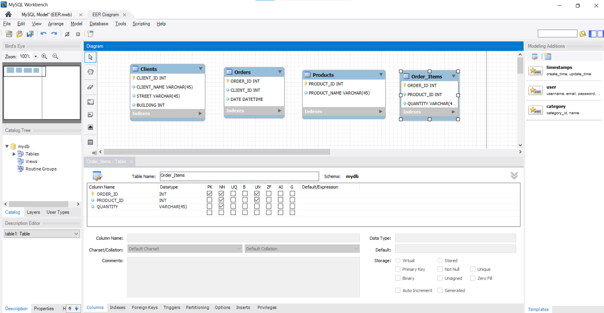
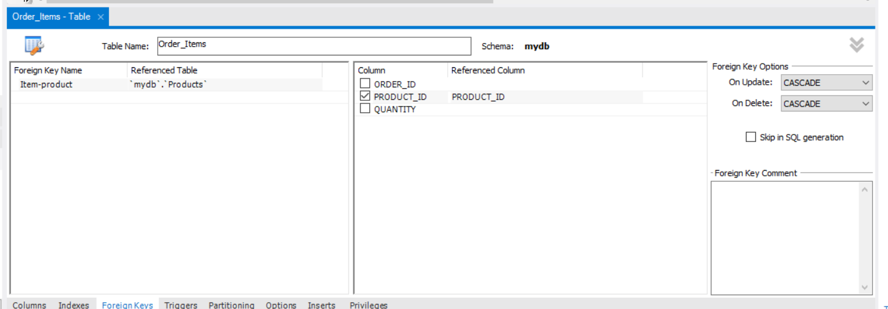
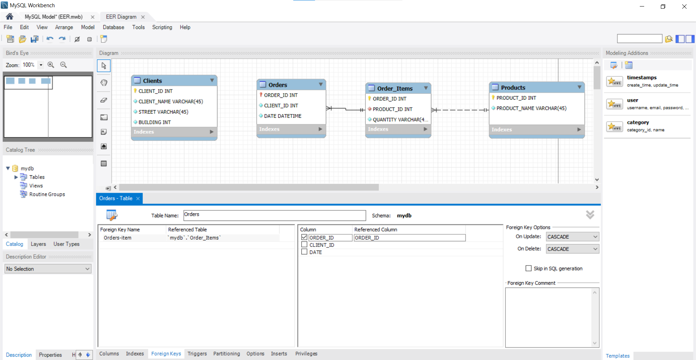

1. Перша нормальна форма (1НФ)
Вимога: Усі значення мають бути атомарними. Ми розділили колонку "Назва_товару і кількість" на окремі поля, а також розбили "Адресу" та "Дату" на складові частини для деталізації.

Перша_нормальна_форма

| Номер_замовлення | Назва_товару | Кількість_товару | Вулиця      | Будинок | Рік_замовлення | Місяць_замовлення | День_замовлення | Клієнт    |
| :--------------- | :----------- | :--------------- | :---------- | :------ | :------------- | :---------------- | :-------------- | :-------- |
| 101              | Лептоп       | 3                | Хрещатик    | 1       | 2023           | 3                 | 15              | Мельник   |
| 101              | Мишка        | 2                | Хрещатик    | 1       | 2023           | 3                 | 15              | Мельник   |
| 102              | Принтер      | 1                | Басейна     | 2       | 2023           | 3                 | 16              | Шевченко  |
| 103              | Мишка        | 4                | Комп’ютерна | 3       | 2023           | 3                 | 17              | Коваленко |

2. Друга нормальна форма (2НФ)
Вимога: Усунення часткових залежностей. Дані розділено на дві сутності: інформація про саме замовлення (хто і коли) та деталі замовлення (товари).

Друга_нормальна_форма

Таблиця 1: Замовлення (Загальна інформація)
| Номер_замовлення | Клієнт    | Вулиця      | Будинок | Рік  | Місяць | День |
| :--------------- | :-------- | :---------- | :------ | :--- | :----- | :--- |
| 101              | Мельник   | Хрещатик    | 1       | 2023 | 3      | 15   |
| 102              | Шевченко  | Басейна     | 2       | 2023 | 3      | 16   |
| 103              | Коваленко | Комп’ютерна | 3       | 2023 | 3      | 17   |

Таблиця 2: Деталі_замовлення (Товари)
| Номер_замовлення | Назва_товару | Кількість |
| :--------------- | :----------- | :-------- |
| 101              | Лептоп       | 3         |
| 101              | Мишка        | 2         |
| 102              | Принтер      | 1         |
| 103              | Мишка        | 4         |

3. Третя нормальна форма (3НФ)
Вимога: Усунення транзитивних залежностей (неключові атрибути не повинні залежати від інших неключових атрибутів). Адреса клієнта залежить від самого клієнта, а не від замовлення. Тому ми виносимо дані клієнта (адресу) в окрему таблицю.

В результаті отримано 3 таблиці:

Третя_нормальна_форма

Таблиця 1: Клієнти (Adress)
| Клієнт    | Вулиця      | Будинок |
| :-------- | :---------- | :------ |
| Мельник   | Хрещатик    | 1       |
| Шевченко  | Басейна     | 2       |
| Коваленко | Комп’ютерна | 3       |

Таблиця 2: Замовлення (Order_date)
| Номер_замовлення | Клієнт    | Рік  | Місяць | День |
| :--------------- | :-------- | :--- | :----- | :--- |
| 101              | Мельник   | 2023 | 3      | 15   |
| 102              | Шевченко  | 2023 | 3      | 16   |
| 103              | Коваленко | 2023 | 3      | 17   |

Таблиця 3: Деталі_замовлення (Order)
| Номер_замовлення | Назва_товару | Кількість |
| :--------------- | :----------- | :-------- |
| 101              | Лептоп       | 3         |
| 101              | Мишка        | 2         |
| 102              | Принтер      | 1         |
| 103              | Мишка        | 4         |

4. ER-діаграма (Entity-Relationship Diagram)
Було розроблено схему в середовищі MySQL Workbench. Нижче наведено візуалізацію зв'язків та атрибутів.

5. Створення таблиць (SQL)
Використовуючи інструмент Forward Engineer у MySQL Workbench, було згенеровано SQL-код для створення структури бази даних mydb.
