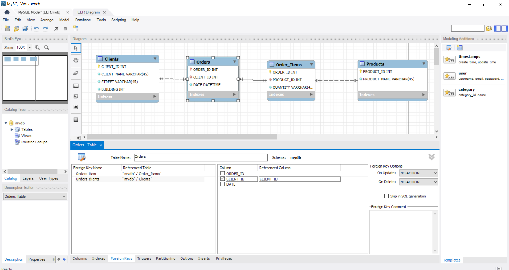
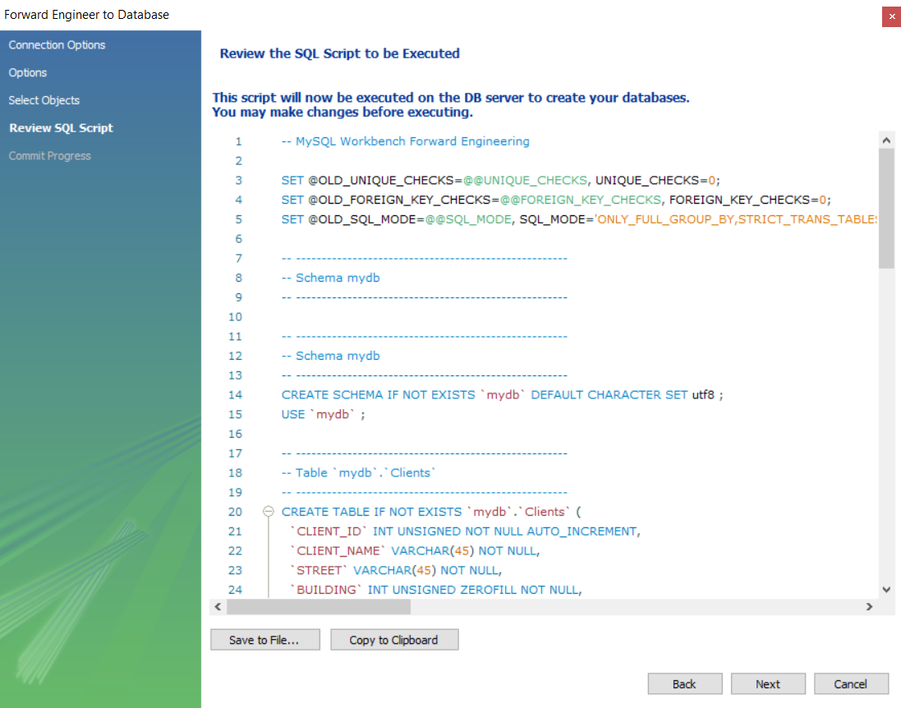
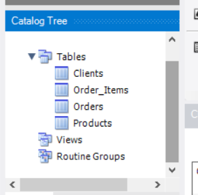

1. Перша нормальна форма (1НФ)
Вимога: Усі значення мають бути атомарними. Ми розділили колонку "Назва_товару і кількість" на окремі поля, а також розбили "Адресу" та "Дату" на складові частини для деталізації.

Перша_нормальна_форма

| ORDER_ID | PRODUCT_NAME | QUANTITY | STREET      | BUILDING | YEAR | MONTH | DAY | CLIENT    |
| :------- | :----------- | :------- | :---------- | :------- | :--- | :---- | :-- | :-------- |
| 101      | Лептоп       | 3        | Хрещатик    | 1        | 2023 | 3     | 15  | Мельник   |
| 101      | Мишка        | 2        | Хрещатик    | 1        | 2023 | 3     | 15  | Мельник   |
| 102      | Принтер      | 1        | Басейна     | 2        | 2023 | 3     | 16  | Шевченко  |
| 103      | Мишка        | 4        | Комп’ютерна | 3        | 2023 | 3     | 17  | Коваленко |

2. Друга нормальна форма (2НФ)
Вимога: Усунення часткових залежностей. Дані розділено на дві сутності: інформація про саме замовлення (хто і коли) та деталі замовлення (товари).

Друга_нормальна_форма

Таблиця 1: Orders (General Info)
| ORDER_ID | CLIENT    | STREET      | BUILDING | YEAR | MONTH | DAY |
| :------- | :-------- | :---------- | :------- | :--- | :---- | :-- |
| 101      | Мельник   | Хрещатик    | 1        | 2023 | 3     | 15  |
| 102      | Шевченко  | Басейна     | 2        | 2023 | 3     | 16  |
| 103      | Коваленко | Комп’ютерна | 3        | 2023 | 3     | 17  |

Таблиця 2: Order_Details (Products)
| ORDER_ID | PRODUCT_NAME | QUANTITY |
| :------- | :----------- | :------- |
| 101      | Лептоп       | 3        |
| 101      | Мишка        | 2        |
| 102      | Принтер      | 1        |
| 103      | Мишка        | 4        |

3. Третя нормальна форма (3НФ)
Вимога: Усунення транзитивних залежностей (неключові атрибути не повинні залежати від інших неключових атрибутів). Адреса клієнта залежить від самого клієнта, а не від замовлення. Тому ми виносимо дані клієнта (адресу) в окрему таблицю, а товари — в окремий довідник.

В результаті отримано 4 таблиці:

Третя_нормальна_форма

Таблиця 1: Clients
| CLIENT_ID | CLIENT_NAME | STREET      | BUILDING |
| :-------- | :---------- | :---------- | :------- |
| 1         | Мельник     | Хрещатик    | 1        |
| 2         | Шевченко    | Басейна     | 2        |
| 3         | Коваленко   | Комп’ютерна | 3        |

Таблиця 2: Orders
| ORDER_ID | CLIENT_ID | DATE       |
| :------- | :-------- | :--------- |
| 101      | 1         | 2023-03-15 |
| 102      | 2         | 2023-03-16 |
| 103      | 3         | 2023-03-17 |

Таблиця 3: Products
| PRODUCT_ID | PRODUCT_NAME |
| :--------- | :----------- |
| 1          | Лептоп       |
| 2          | Мишка        |
| 3          | Принтер      |

Таблиця 4: Order_Items
| ORDER_ID | PRODUCT_ID | QUANTITY |
| :------- | :--------- | :------- |
| 101      | 1          | 3        |
| 101      | 2          | 2        |
| 102      | 3          | 1        |
| 103      | 2          | 4        |

4. ER-діаграма (Entity-Relationship Diagram)
Було розроблено схему в середовищі MySQL Workbench. Нижче наведено візуалізацію зв'язків та атрибутів.

5. Створення таблиць (SQL)
Використовуючи інструмент Forward Engineer у MySQL Workbench, було згенеровано SQL-код для створення структури бази даних mydb.

